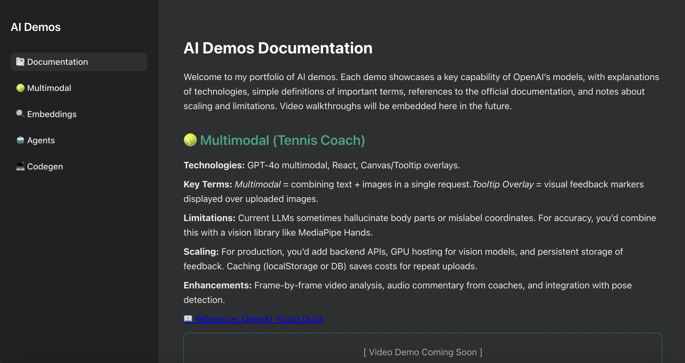
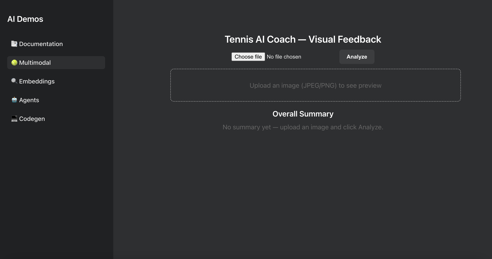
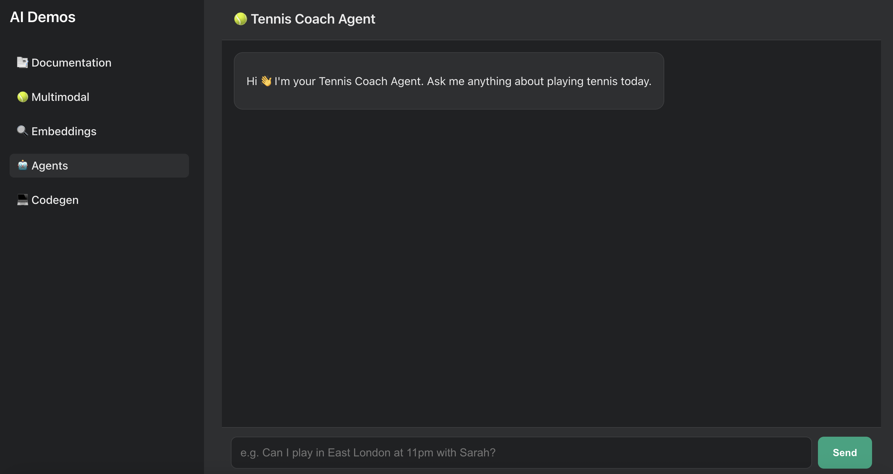
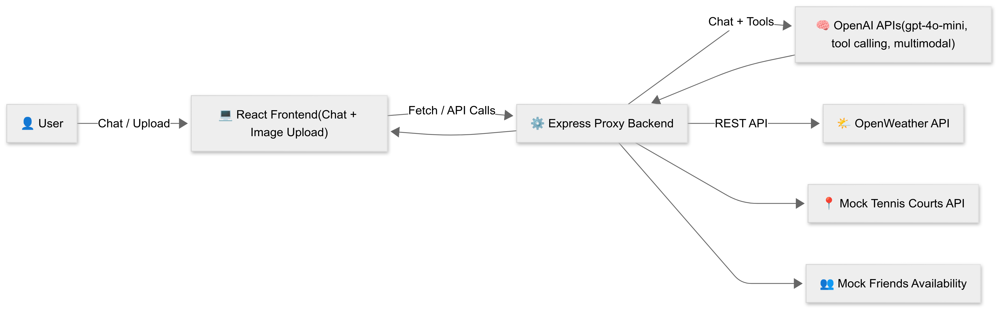
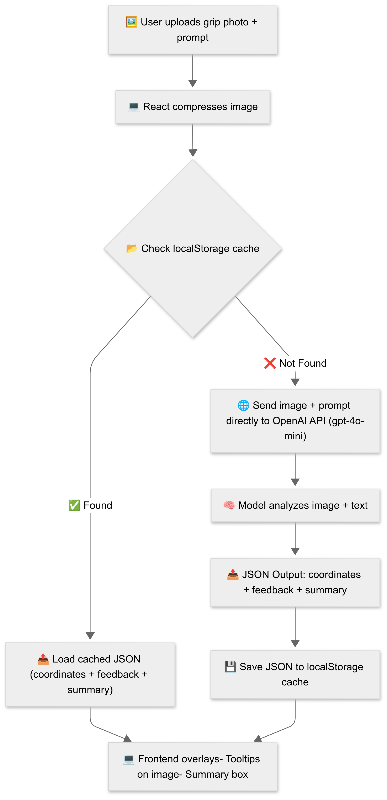
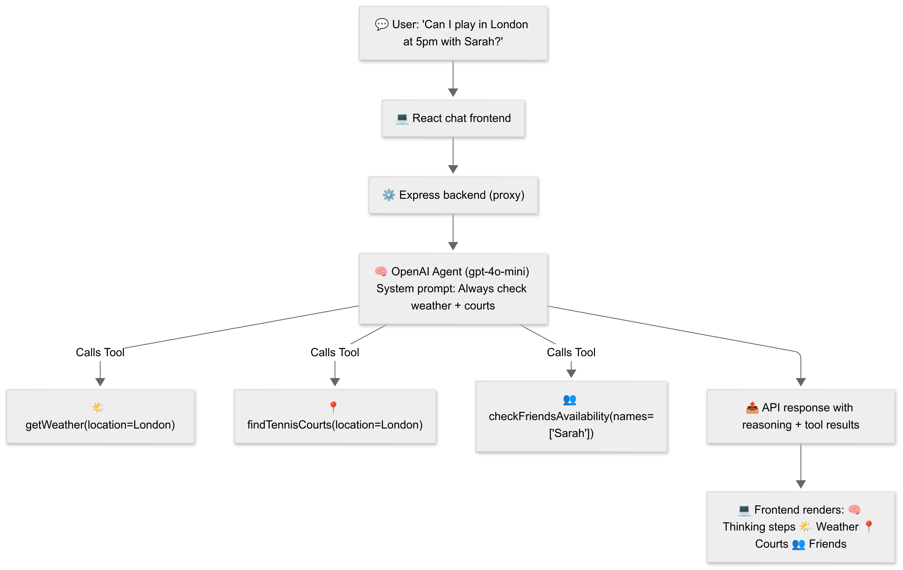

🎾 Tennis AI Coach
---

Tennis AI Coach is a demo project that combines one of my favourite hobbies (tennis!) with my passion for exploring AI developer tools.
It demonstrates how to build multimodal and agentic experiences using OpenAI APIs — analyzing tennis grip photos and providing intelligent feedback with reasoning and tool results.



✨ Purpose
---

- Learn and engage with OpenAI APIs (multimodal + agents).

- Show how to integrate caching, tool-calling, and developer-friendly UIs.

- Provide other developers with a clear starting point for their own demos and experiments.

🚀 Features
---

🖼️ Upload a tennis grip photo → get feedback + summary.

🧠 OpenAI agent reasoning steps displayed in UI.

🌤️ Weather tool, 📍 tennis court availability, 👥 friends availability.

🔄 LocalStorage cache (no DB needed).

💻 OpenAI-style chat interface with bubbles, tool results, and emojis.

Multimodal UI


Agents UI


🛠️ Setup
Prerequisites
---
```
Node.js (18+)
```
```
npm or yarn
```

API tokens:
```
OPENAI_API_KEY → from OpenAI Platform

WEATHER_API_KEY → from OpenWeather
```

Create a .env file in the project root:

```
OPENAI_API_KEY=your_openai_key_here
WEATHER_API_KEY=your_openweather_key_here
```

🖥️ Running the App
---
Clone the repo and install dependencies:

```
npm install
```

Run the frontend:

```
npm start
```

Runs at http://localhost:3000

Run the backend proxy (in a separate terminal):
```
node server.js
```

Runs at http://localhost:5001

⚡ Both must be running simultaneously.

📂 Project Structure
---
```
/src
  /projects
    ChatAgent.js       # Chat UI
    Multimodal.js      # Grip analyzer
server.js              # Express proxy + agent tools
/docs                  # Screenshots + diagrams
```
📊 Diagrams
---
System Architecture


Multimodal Analyzer 


Agent Reasoning 


🤝 Contributing
---

This project is meant as a learning demo.
If you want to extend it (new tools, UI features, or documentation), feel free to open a PR or share ideas.

📚 Learn More
---
[OpenAI Docs](https://platform.openai.com/docs)

[Create React App Docs](https://create-react-app.dev/docs/getting-started/) 

[OpenWeather API](https://openweathermap.org)